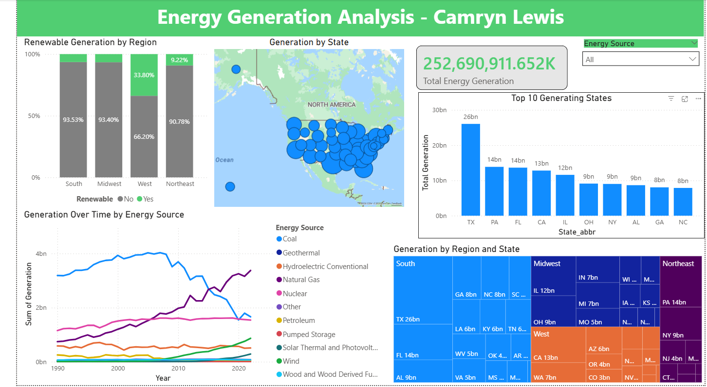

# PowerBI Energy Generation Analysis
## Project Overview
I was given a task to analyze the power generation data in different states in the last three decades and find the significant patterns to ensure that companies are following environmental rules and regulations. To support environmental agencies in their various responsibilities, which include monitoring regulatory compliance, assessing environmental impacts, developing policies, and reaching out to the public, I am tasked with producing a series of charts. These charts will offer valuable insights into the data, aiding decision making processes and enhancing the agency's effectiveness in safeguarding the environment. 

---

## Objectives
- Analyze total energy generation across the US
- Compare renewable vs non-renewable energy by region
- Identify top energy producing states
- Track changes in energy generation over time by source

---

## Tools & Technologies 
- Power BI (Data Visualization)
- Excel (Data Source)
- DAX (Data Modeling & Calculations)

## Dashboard Preview

## Key Features
- Treemap : Shows regional and state level contributions
- Time Series : Tracks energy generation trends by source over time
- Stacked Bar Chart : Compares renewable vs non-renewable energy by region
- Top 10 States Chart : Highlights highest energy producing states
- Slicer : Filter dashboard by energy source
- Interactive Map : Visualizes generation by states across the U.S.
- Card : Displays total energy generation 

--- 

## Key Insights
- Texas dominates energy production
- Renewable energy adoption varies by region
- Shift in energy over time 
